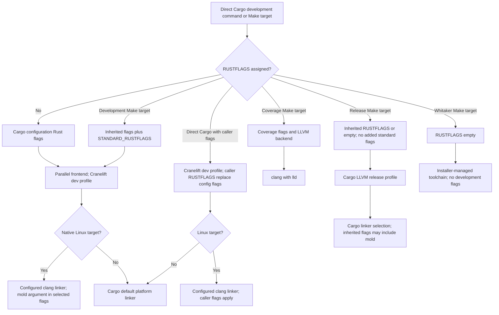

# Developer Guide

This guide explains the contributor workflow and implementation tooling for the
generated Statelet project.

## Normative references

- [Technical design](design.md) defines crate boundaries, public API decisions,
  and validation gates.
- [Repository layout](repository-layout.md) explains the top-level files,
  directories, and ownership boundaries.
- [Documentation contents](contents.md) indexes the full documentation set.

## Generated project shape

Statelet uses Rust 2024, a pinned nightly toolchain, strict lint settings, and
documented starter code. The current repository is a library project and renders
`src/lib.rs`.

## Local Workflow

Install `rustup` and `uv` first. Local repository Python gateways use managed
CPython 3.14. Native Linux development builds need `clang` and the pinned
`mold` linker; coverage also needs `lld`. The local linker installer requires
`curl`, `sha256sum`, and `tar`. Markdown lint installation needs Node.js and
`npm`.

Run `make install-build-tools` to provision the pinned Rust toolchain,
components, and Linux linker, then `make check-build-tools` to verify them.
Install the Markdown tools with `make install-mdtablefix` and
`make install-markdownlint`. In CI, the shared `setup-rust` action owns the
linkers and `make install-rust-toolchain` installs only additional repository
components. Install the published Nextest binary without source fallback:

```sh
cargo binstall --no-confirm --strategies crate-meta-data,quick-install cargo-nextest
```

Provision Whitaker through the approved shared `install-whitaker` action; its
managed toolchain is separate from Statelet's development toolchain.

Use `make all` for formatting, linting, typechecking, tests, workflow
contracts, and spelling. `make lint` runs rustdoc, Clippy, Whitaker, and the
Python lint gateways. `make test` requires the binary-installed cargo-nextest
runner and runs the Python workflow contracts under managed CPython 3.14.
`make audit` derives the Rust workspace root with `cargo metadata`, extracts
its manifests under the same managed interpreter, and runs `cargo audit` once
from the workspace root. `make coverage` uses `cargo llvm-cov` with `lld`.

The generated `Makefile` exposes these public targets:

- `make all` runs formatting checks, linting, typechecking, tests, and spelling.
- `make check-fmt` verifies Rust formatting and Markdown formatting.
- `make lint` runs rustdoc, Clippy, Whitaker, Pylint, and the pinned df12
  Python lints. Rust warnings are denied.
- `make typecheck` runs `ty` over every repository Python source and Cargo
  check over the Rust targets.
- `make test` runs cargo-nextest, Cargo doctests, then Python workflow
  contracts in sequence, even when invoked with `make -j`. The workflow
  contracts use pinned dependencies and managed CPython 3.14.
- `make build` builds the debug target.
- `make release` builds the release target.
- `make coverage` writes `lcov.info` using `cargo llvm-cov` and `lld`.
- `make audit` derives the Rust workspace root with `cargo metadata`, parses
  it with managed CPython 3.14, and runs `cargo audit` once from that root.
- `make lint-python` runs Pylint and every message in the pinned
  `df12-python-lints` release over Python files under `.github`, `tests`,
  `scripts`, `benches`, and `benchmarks`.
- `make typecheck-python` runs the pinned `ty` typechecker over the same
  discovered files. Both gateways use managed CPython 3.14; their versions and
  the complete source inventory are defined in the Makefile. The root
  `.python-version` selects 3.14 for direct `uv` script launches; the
  [scripting standards](scripting-standards.md) describe the managed shebang,
  lint, typecheck, and test policy without suppressions.
- Workflow contract readers stay under `tests/workflow_contracts`. The
  `suite_provisioning.py` module owns command and runner classification, while
  `suite_discovery.py` owns graph traversal and route inventory for those
  contracts. `markdown_ci_contract.py` and `whitaker_contracts.py` own their
  invocation policies; `workflow_reading.py` provides generic YAML and job
  parsing. Shared CV-005 coverage policy stays in the pinned upstream library.
  Private helpers split shape validation and individual findings within their
  owning module. These support modules remain test-only; runtime code and
  unrelated document contracts must not depend on them.

- `make markdownlint` checks Markdown files.
- `make spelling` runs the pinned `typos-config-builder gate`, which
  regenerates `typos.toml` from the shared en-GB-oxendict dictionary, checks
  all tracked files, and applies the shared phrase corrections. It never checks
  `typos.toml` for drift.
- `make nixie` validates Mermaid diagrams.

The ADR 003 and ADR 004 integration contracts keep their parsing helpers
private to their respective test roots. A borrowed source-document bundle may
group the specific documents a quoted-clause check reads together; its callers
remain the owning contract and its negative controls. ADR 004's fixed-width
table mapper belongs to its register parser and is reused only by that parser's
typed register-row constructors. Neither helper is a general Markdown parser:
malformed text remains a deliberate test input, and each contract continues to
report its own exact repair message. ADR 004's note policy shares one
status-row lookup across contribution and cell validation so those checks
cannot silently disagree about which register row a cell selects. Blocking
still scans every matching row: an inadmissible duplicate must block a note.
The register's existing multiset-state type owns its column values and expected
outcome prefix; totality checks and note aggregation reuse that mapping.

GitHub Actions Act validation lives in `.github/workflows/act-validation.yml`.
The main `.github/workflows/ci.yml` workflow deliberately does not run
`make test WITH_ACT=1`; the separate Act workflow runs those slower
container-backed checks in parallel.

Install the published test runner with cargo-binstall's binary-only strategy
before running `make test` locally. The preflight reports this command when the
runner is absent:

```sh
cargo binstall --no-confirm --strategies crate-meta-data,quick-install cargo-nextest
```

## V0.1 exit-register contract

`tests/v0_1_exit_register_contract.rs` owns the integration-test scenarios for
ADR 003. Its private `tests/v0_1_exit_register_contract/support.rs` child owns
only the pure Markdown parser and policy predicates used by those scenarios.
Its private `tests/v0_1_exit_register_contract/support/split_case.rs` child,
called only by `support.rs`, owns the R1 companion-document split-case policy.
Its private `tests/v0_1_exit_register_contract/fixtures.rs` child owns the
canonical valid-register fixture shared by the integration scenarios. Its
private `tests/v0_1_exit_register_contract/regression_controls.rs` child owns
edge-case parser and citation scenarios. Keep these modules test-only: do not
reuse them from runtime code or other document contracts. A future contract
with different document grammar should own its own parser, policy, and
regression boundary rather than extending these children.

The register is machine-checked against the cited design passages, glossary,
and roadmap gates. Changes to design sections 11.1, 11.2, 13.6, or 13.7, or to
roadmap tasks 2.2.3, 3.1.3, or 4.3.1, must update ADR 003 and its test together
when `make test` reports deliberate document drift.

The contract test keeps `googletest` and `pretty_assertions` test-only. It uses
`googletest` for matcher-based assertions that identify the affected verdict
combination, and `pretty_assertions` for readable diffs when parsed document
rows differ. Neither dependency belongs in the runtime crate.

## StateName consumption contract

`tests/state_name_consumption_contract.rs` owns the integration-test scenarios
for [ADR 004](adr-004-state-name-consumption-evidence.md). Its child modules
each own one invariant class rather than a share of the text: `parse.rs` holds
the one delimited-table syntax function, `types.rs` the register vocabulary and
the `ParseError` messages, `claims.rs` what an evidence cell's words say — a
citation, a consumer, a required property, or the strings an `Enumerated` cell
must list — and `policy.rs` what those answers oblige, naming admissibility,
the note verdict, and the four obligations each cell carries. The checks that
bind two documents to each other are one module per binding: `clauses.rs` for
quoted-clause resolution, `registers.rs` for the cross-register checks and the
status register's own consistency, and `roadmap.rs` for the roadmap's
task-record grammar, the gate table, and the success criterion. `notes.rs`
holds the scan of `docs/validation-notes/` and the scratch roots its controls
scan instead, and `fixtures.rs` the row constants the negative controls build
documents from. `claim_properties.rs` is not a scenario module: it holds the
property suite over the evidence predicates — generated properties rather than
named scenarios. That module is why `proptest` appears under
`[dev-dependencies]` in `Cargo.toml`: the evidence predicates read arbitrary
text, so their invariants are properties rather than cases, and `proptest` is
the only dependency the contract adds. It is test-only and reaches no shipped
binary.

The scenarios sit in seven modules, one per invariant class, so that the
400-line cap binds each part of the contract alike:

- `anchor_scenarios.rs` — the template and the roadmap as bindings: does the
  blank form instantiate the register, and does the roadmap still carry the
  nouns the register maps?
- `claims_scenarios.rs` — what an evidence cell may say: accepted citation
  shapes, and the words a cell may and may not use for a consumer or a property.
- `clause_scenarios.rs` — whether the clauses ADR 004 quotes still resolve, and
  against which task's record a roadmap quotation is bound; the subject is the
  quotation, where `anchor_scenarios.rs` resolves a gate fragment.
- `criterion_scenarios.rs` — which copy of a sentence is the success criterion
  when the same clause is quoted in more than one document.
- `note_scenarios.rs` — a note's cells and the verdict they resolve to,
  including the blocking statuses and the contradictions.
- `register_scenarios.rs` — how the registers parse, and their internal
  consistency.
- `scan_scenarios.rs` — the directory scan: which files it reads, what an
  unreadable or absent directory means, and the end-to-end path over a
  populated scratch tree.

The contract reads ADR 004, the template, `docs/design.md`, `docs/roadmap.md`,
and `docs/adr-002-transition-boundary-scope.md` with `include_str!` and parses
them. Four edits break it by design, and each reports where to repair the
document rather than what Rust expects:

- Changing a register's field names, statuses, admissibility flags, or
  contributions. Both the blocking set and the verdict are read from the
  register, so ADR 004 and `fixtures.rs` must change together.
- Rewording roadmap task 1.1.3's success criterion, or removing a criterion
  noun a register field maps. The task text is the link between the roadmap and
  the instrument.
- Rewording the three clauses ADR 004 quotes in its evidence section, or moving
  one to a different section of its source.
- Changing the template's fields or their order. The template is the schema
  every future note instantiates.

The gate table binds gates to roadmap tasks by title *fragment*, not by task
number, so completing a bound task or renumbering the roadmap does not break
the build. That is deliberate: the project's `mapsplice` tooling renumbers
tasks, and a numeric binding would freeze four numbers — the four gates S1 to
S4 ADR 004's table names. ADR 003's exit register reaches the opposite
conclusion for its own three because there the roadmap numbering is
load-bearing rather than incidental, and the two are not in conflict: each
binds by the identifier its decision actually consumes.

### The one lint exemption

`dylint.toml` exempts exactly one module —
`state_name_consumption_contract::notes` — from Whitaker's
`no_std_fs_operations`, which denies `std::fs` in integration-test crates. The
lint cannot be suppressed by any Rust attribute; a `dylint.toml` entry is the
only working mechanism, and the path-scoped form is the narrower one. The
exemption is confined to `notes.rs` so that every parser, policy predicate and
invariant check in this contract stays under the lint. The exemption carries
its rationale in the `dylint.toml` comment beside it.

`camino` enumerates the directory (`read_dir_utf8`) and yields a path per
entry, but has no content-read API, so the content read is the one operation
that needs `std::fs`.

### Filling a note

A Phase 2 engineer copies `docs/phase-2-validation-note-template.md` to
`docs/validation-notes/<task>-<subject>.md` and commits the filled copy with
the work that produced it. The template is never edited to record an
observation: editing it changes the schema for every future note and breaks the
contract that checks the form against the register it instantiates.

A note declares which contract owns it with a marker comment on a line of its
own, which is what lets several unrelated decisions share one directory. A file
without the `<!-- state-name-note -->` marker is ignored by this contract
entirely, including a note written for another decision.

A note that selects a blocking status is still committed, still useful and
still checked. It resolves to `Not resolved`, names the blocking field and
status, and contributes nothing to the verdict. Such a note is never deleted to
make the suite pass: a blocked note that names its blocker is a finding, and
the finding is the point.

## Development build standard

Cargo uses Cranelift for development builds, with the parallel frontend
(`-Zthreads=8`) and Linux clang/linker setup configured in
`.cargo/config.toml`. Cargo takes `RUSTFLAGS` from one source; assigning it
replaces the config's build and target Rust flags, while the configured linker
selection remains active. Make's development recipes compose inherited flags
with `STANDARD_RUSTFLAGS` to retain the parallel frontend and Linux linker
argument. The lint, typecheck, test, and coverage targets also add
`-D warnings`; `make build` does not. The pinned linker binary is installed and
checked locally by `make install-build-tools` and `make check-build-tools`.
CI's pinned `setup-rust` action owns the Linux linkers; the following
`make install-rust-toolchain` installs Statelet's additional Rust components
without downloading the linker again.

The Linux linker selector assumes native compilation, where clang targets the
host. A cross-compilation to another Linux target would also match the selector
and needs an explicit target compiler and sysroot; Statelet does not configure
cross-compilation today.

Release builds use Cargo's LLVM release profile. Coverage uses LLVM code
generation and `lld` because coverage instrumentation is LLVM-specific; the
local target and shared CI action provide that override. Without it, Cranelift
rejects coverage instrumentation:

```text
error: `-Cinstrument-coverage` is LLVM specific and not supported by Cranelift
```

The diagram covers direct Cargo development commands and the Make development,
coverage, release, and Whitaker routes. Direct Cargo commands use Cargo's
configured Rust flags when `RUSTFLAGS` is unset. A direct Cargo release command
follows that same configuration path for Rust flags; the release branch below
describes `make release`.



*Figure 1: Direct Cargo commands use configured Rust flags only when
`RUSTFLAGS` is unset; caller assignments replace those flags. Development Make
targets append `STANDARD_RUSTFLAGS`, with `-D warnings` added by lint,
typecheck, test, and coverage but not `make build`. Coverage uses LLVM with
`lld`. `make release` adds no standard flags, but retains inherited caller
flags and Cargo's LLVM release profile. Whitaker clears `RUSTFLAGS` and uses
its installer-managed toolchain. Caller `RUSTFLAGS` do not replace the Cargo
development profile's Cranelift backend. The configured Linux clang linker
remains active independently of `RUSTFLAGS`; other targets use Cargo's default
platform linker.*

Whitaker uses its installer-managed toolchain and does not receive the
repository's development `RUSTFLAGS`. The toolchain and CI routes are checked
by the build and workflow contracts.

## Lint baseline

The authoritative Rust lint tables live in the root `Cargo.toml`, with Clippy
complexity thresholds and disallowed-method details in `clippy.toml`. The
selected Concordat package versions and the approved environment-access
extension are recorded in the
[baseline execution record](rust-baseline-execution.md). Statelet is currently
a single crate and uses `[lints.*]` tables. If it becomes a workspace, move the
shared tables to `[workspace.lints.*]` and make every member inherit them with
`[lints] workspace = true`; do not create a workspace just to match an example.

Fix findings at source. A suppression needs a narrow, valid scope and a reason
tied to evidence; fixtures and helpers do not become exempt merely because a
test consumes them. Keep direct environment reads and mutations behind injected
configuration or process-state dependencies. Recognized test bodies may use
`expect` with a reason, while shared fixtures and setup helpers remain
fallible. The complexity ceilings are 9 for cognitive complexity, 4 arguments,
70 lines, and 4 levels of nesting. `rust-toolchain.toml` pins the nightly
components for Clippy, rustfmt, LLVM tools, Cranelift, and rust-analyzer.

## Markdown tooling

`make fmt` and `make check-fmt` use `mdtablefix` 0.6.1. Install that exact
Cargo package with `make install-mdtablefix`. CI installs the same version
through the pinned shared action. Install `markdownlint-cli2` 0.23.2 locally
with `make install-markdownlint`; it installs the exact package version bundled
by the pinned CI action. The Makefile records both versions, so update them
only alongside their CI action pin and bundled package version.

## Spelling policy

The tracked `typos.toml` is generated from the shared estate dictionary and the
repository-specific `typos.local.toml` overlay. Never edit generated entries by
hand. Add only narrow repository terminology to the overlay.

`make spelling` runs `typos-config-builder gate`, pinned by
`TYPOS_CONFIG_BUILDER_VERSION` in the `Makefile`. The gate regenerates
`typos.toml`, runs its pinned Typos release over all tracked files, and
enforces the shared phrase corrections, which Typos cannot express because it
splits hyphenated phrases into separate words. Commit the regenerated file; a
tracked `typos.toml` is never checked for drift, because the shared dictionary
is live. The builder refreshes the shared dictionary into the untracked
`.typos-oxendict-base.toml` cache only when the authority is newer, records
refresh metadata in `.typos-oxendict-base.json`, and reuses a valid local cache
when the authority is unavailable.

Quoted APIs and identifiers retain their upstream spelling; put them in
backticks or fenced code blocks where practical rather than adding broad
word-level exceptions.

## Coverage publication

Main owns both persistent coverage outputs, following concordat's CV-005 rule.
Pull requests measure coverage in `ci.yml` with `with-ratchet: 'true'` and
`publish-artefact: 'false'`, so they check the ratchet against the stored
baseline and do nothing else: no pull request uploads a report, runs
`cs-coverage`, receives `CS_ACCESS_TOKEN`, or contacts `codescene.io`.
CodeScene accepts an upload only for an analysed branch, which a pull request
head is not, and its check mode fails on every project whose coverage gates are
off. What the split takes off the pull request is the call to the service; the
CLI archive is already pinned by digest.

`.github/workflows/coverage-main.yml` is the one publisher. It runs on a push to
`main` and on dispatch. A push to `main` writes the ratchet baseline; a
dispatch reads the stored baseline without advancing it. The workflow uploads
to CodeScene only when both hold:

- a `Check CodeScene token` step, whose sole command is
  `echo "available=${{ secrets.CS_ACCESS_TOKEN != '' }}" >> "$GITHUB_OUTPUT"`,
  reports the token as set; the expression is evaluated before the shell runs,
  so the step binds nothing;
- `github.ref == 'refs/heads/main'`, since a dispatch may name any branch.

The upload passes the token only as `access-token`, never through an `env`: the
upload action is composite and hands its step's `env` to the nested steps it
runs. The concurrency group is `${{ github.workflow }}-${{ github.ref }}` and
never cancels. Runs for the same ref never overlap, and a newer trigger
replaces an older pending run rather than queueing behind it. Runs on other
refs may overlap a `main` run, but the upload's ref conjunct keeps them from
publishing. GitHub does not promise to start runs in trigger order, so this
does not guarantee commit order. A manual re-run of an older run keeps its SHA
and its run id: it republishes that commit's coverage to CodeScene. Its
baseline cache key is the original run's, so it saves a baseline only when that
entry is absent: the original run saved none, or the entry has expired or been
evicted. Two gaps are known and accepted. A Dependabot pull request merged by
the automerge workflow with `GITHUB_TOKEN` fires no push, so it publishes
nothing until the next push to `main` (shared-actions #518). A dispatch that
replaces a pending push uploads coverage, but `generate-coverage` saves the
baseline only on a push, so the baseline stays behind until the next push
(shared-actions #518).

`make test-workflow-contracts` holds the rule by running
`cv005-contracts check`, the shared contract library in `leynos/shared-actions`
(`packages/cv005-contracts`), from a full commit named by `CV005_CONTRACTS_REF`
in the Makefile, then the mutation-testing and build-standard pytest contracts
in `tests/workflow_contracts/`. A fix to the rules is therefore a pin bump. The
target needs `uv`, which fetches the Python 3.13 the library runs under. The
repository's one parameter is its `repository` name in `.github/cv005.toml`.
The library proves each clause against breaching fixtures as well as against
the real workflows: the pull-request clauses run over every workflow a pull
request can reach through local `uses:` calls, the host and token clauses read
every scalar in each document, the upload condition is split on `&&` with any
`||` refused, and workflows are parsed with duplicate keys refused.

[`cv005_wiring_test.py`](../tests/workflow_contracts/cv005_wiring_test.py)
holds the local wiring: the pin is a full commit, the target runs the pinned
checker with `check --repository .` under Python 3.13, `.github/cv005.toml`
names this repository, `make all` includes the target, and CI runs it. The
decision is recorded in
[ADR 005](adr-005-adopt-the-shared-cv005-contract-library.md).

## Workflow pins and Dependabot

Dependabot owns the upgrade of GitHub Actions and reusable workflows, including
calls into `leynos/shared-actions`. Contract tests that assert a caller's exact
commit SHA create a lockstep dependency: every time Dependabot opens a bump PR,
the test fails until a human edits the pinned constant to match. That defeats
the purpose of automated dependency updates and turns a routine bump into a
manual chore.

Contract tests may still verify the *shape* of a reusable-workflow caller. They
must not verify the specific SHA value.

- Do assert the workflow references the correct reusable workflow path.
- Do assert the ref is pinned to a full 40-character commit SHA, not a
  mutable branch such as `main` or `rolling`.
- Do assert the expected `on:` triggers, least-privilege `permissions:`, and
  the inputs the caller relies on.
- Do not hard-code the current SHA value as an expected string. Match it with
  a pattern instead.
- Do not fail a test purely because Dependabot bumped the pinned SHA.

```python
import re

SHA_RE = re.compile(r"^[0-9a-f]{40}$")

def test_uses_pinned_full_sha(caller_step):
    ref = caller_step["uses"].split("@")[-1]
    assert SHA_RE.match(ref), f"expected a 40-hex commit SHA, got {ref!r}"
```

If a workflow's behaviour genuinely depends on a feature only present from a
particular commit onwards, express that as a comment or a changelog note, not
as a test assertion on the SHA string.

### Security audit ignores

Security audit jobs may set `CARGO_AUDIT_IGNORES` for narrowly scoped RustSec
advisories that affect unused or tooling-only dependency paths. Keep each
ignore tied to a documented runtime impact analysis, and remove it when the
affected dependency leaves the graph or the project starts using the advised
runtime path.

## Mutation-testing workflow contract tests

This repository runs scheduled, informational mutation testing through a thin
[caller workflow](../.github/workflows/mutation-testing.yml). It delegates to
the shared reusable workflow
`leynos/shared-actions/.github/workflows/mutation-cargo.yml`. The heavy lifting
— running `cargo-mutants` and summarizing survivors — lives in
`shared-actions`; this repository carries only declarative configuration. The
run is **informational only**: it never gates a pull request. Survivors are
reported through the job summary and downloadable artefacts so they can be
triaged into tests, not enforced as a blocking check.

The workflow runs on a **daily schedule** and on **manual dispatch**; select a
branch in the Actions "Run workflow" control to exercise a feature branch.

The caller passes a small set of configuration inputs, each carrying intent:

- `extra-args` — arguments forwarded to `cargo-mutants` (here
  `--all-features`) so the mutation run matches the CI test baseline
  (`CARGO_FLAGS = --all-targets --all-features`); a mismatch would report
  feature-gated code as untested.
- `install-mold` and `install-clang-lld` — both `'true'`, so `setup-rust`
  installs `clang`, `lld`, and `mold` before mutation runs, mirroring the
  linker setup that `.cargo/config.toml` makes mandatory for every cargo build;
  without them, mutated builds would fail before a single mutant could be
  tested. CI, coverage-main and act-validation pass the same two inputs to
  their own `setup-rust` steps instead of an `apt-get` step.

The `uses:` reference pins the shared workflow to a full 40-character commit
SHA rather than a branch or tag, so a force-push upstream cannot silently
change what runs here. The contract test asserts only that the pin is a full
commit SHA, not a particular value, so Dependabot bumps it automatically
without any accompanying test edit.

Because the caller is configuration rather than code, a contract test in
[mutation_testing_test.py](../tests/workflow_contracts/mutation_testing_test.py)
pins the shape it must uphold, failing the pull request when the caller drifts
— repointing the pin at a branch, widening the token scope, or dropping the
linker setup or feature configuration — rather than letting the breakage
surface only in a scheduled run. The test module self-skips when the workflow
file is absent, so it does not fail in working copies that omit `.github/`. Run
it locally with `make test-workflow-contracts`. The test validates:

- the `uses:` reference targets `mutation-cargo.yml` pinned to a full commit
  SHA;
- the job is named `mutation` and is the only job in the workflow;
- the `with:` block carries exactly the expected `extra-args`,
  `install-mold`, `install-clang-lld`, and component-only `setup-commands`;
- job permissions are least-privilege (`contents: read`, `id-token: write`)
  and the workflow-level default token scope is empty;
- `concurrency` serializes runs per ref without cancelling one in progress;
  and
- the triggers keep the daily schedule and a plain `workflow_dispatch` with no
  legacy branch input.

## Consumer workflow parsing

`tests/workflow_contracts/workflow_reading.py` is private support for the local
build-tool, Markdown, mutation, and Act invocation contracts. It parses YAML
without losing duplicate keys or ambiguous booleans, enumerates jobs and steps,
and classifies local workflow references. Only those consumer contracts may use
it. Coverage publication and token policy remain in the pinned shared CV-005
library; local tests must not duplicate that policy.
